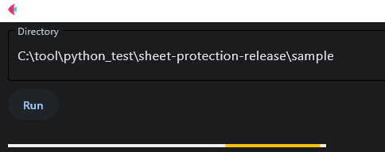

# sheet-protection-release
This Python application removes sheet protection from all \*.xlsx files in a given directory (and its subdirectories). This tool runs as a web application created using Flet.

### Note
- Does not unprotect the book.
- xls file is not applicable.

## Usage
Double-click main.py to start it.
Specify the directory and click the **[Run]** button to execute.

* The generated processed file will have "_unprotected" at the end of the base name.

## Screen image

## License
MIT

## Author
Kenta Goto
